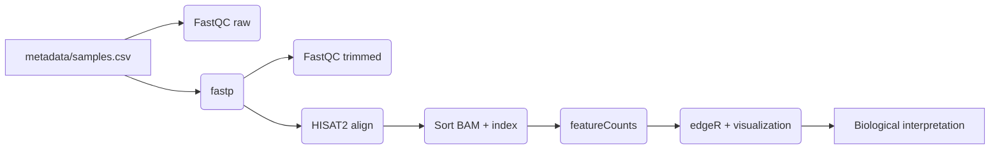
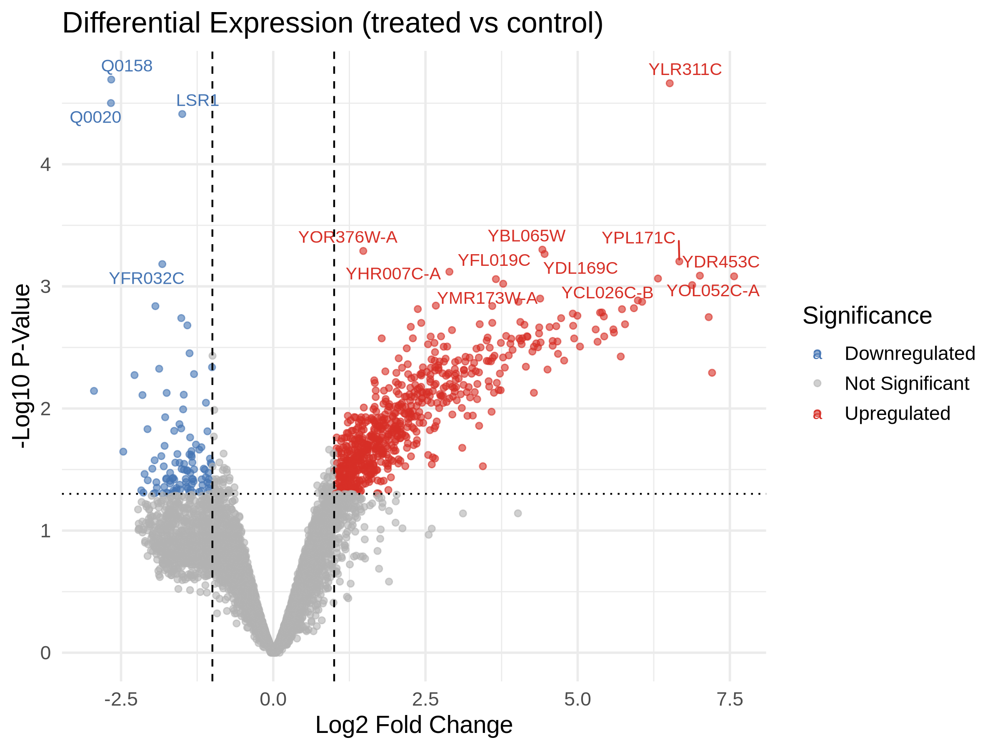
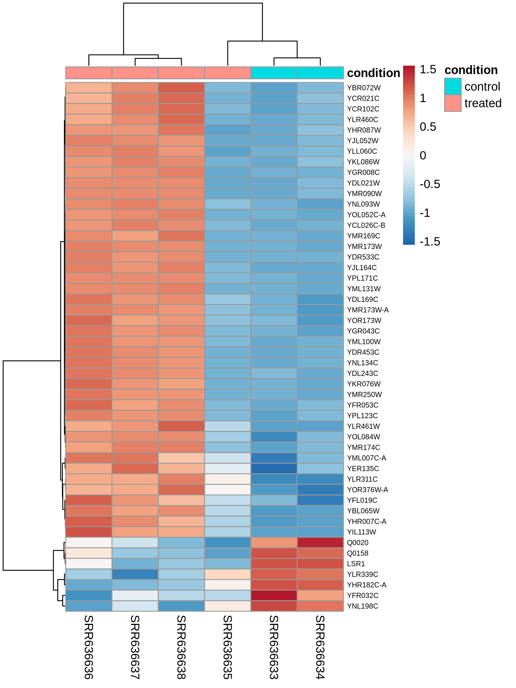

# Yeast Oxidative Stress Analysis

Automated RNA-Seq workflow for dissecting the oxidative stress response of *Saccharomyces cerevisiae* challenged with hydrogen peroxide (PRJNA184040).

## Repository Layout

```
yeast_stress/
├── docs/                     # Biological interpretation
│   └── reproducibility.md    # Step-by-step reproduction guide
├── metadata/                 # Sample annotations used by the workflow
├── results/                  # Example outputs (counts + QC artifacts)
├── src/                      # Nextflow pipeline + helper scripts
├── scripts/                  # Data + reference preparation helpers
├── Makefile                  # Automation entry points
├── Dockerfile                # R/edgeR container used for DE analysis
├── docker-compose.yml        # Stand-alone utility containers
├── nextflow.config           # Pipeline defaults
└── README.md
```

## Reproducible Workflow

### Requirements
1. [Nextflow](https://www.nextflow.io/) 22.10+
2. Either:
   - **Conda/mamba** (recommended): `conda env create -f environment.yml`
   - **Docker** (optional fallback): build the analysis image with `docker build -t yeast-oxidative-stress-analysis .` and run the pipeline with `-profile docker`.

### Automated Setup (Makefile)

The included `Makefile` wraps every preparatory step. Run the following in order (requires the Conda environment or the listed tools on PATH: SRA Toolkit, pigz, curl, hisat2-build, and optionally gffread):

1. `make download-data` – downloads the raw FASTQs listed in `metadata/samples.csv` (set `PARALLEL=<n>` to fetch multiple SRR accessions at once and `THREADS=<n>` to tune `fasterq-dump` threads) and records SHA256 checksums.
2. `make prepare-reference` – pulls the sacCer3 genome + annotation and builds the HISAT2 index (files `sacCer3.*.ht2` in `data/genome/`; set `BUILD_THREADS=<n>` to accelerate `hisat2-build`).
3. `make docker-image` – builds the `yeast-oxidative-stress-analysis:latest` container used in the edgeR step.
4. `make run` – executes the entire Nextflow workflow with the default parameters (uses the Conda profile by default; add `PROFILE=docker` to use containers).

See `docs/reproducibility.md` for a detailed checklist with the expected outputs from each step.

### Input Data
1. Download the six FASTQ files from SRA project PRJNA184040 (SRR636633–SRR636638).
2. Place the files under `data/` (default glob: `data/*.fastq.gz`).
3. Verify/adjust `metadata/samples.csv`, which defines the sample IDs, conditions, and expected FASTQ paths:
   ```csv
   sample_id,condition,fastq
   SRR636633,control,data/SRR636633.fastq.gz
   ...
   SRR636638,treated,data/SRR636638.fastq.gz
   ```
4. Prepare the HISAT2 genome index in `data/genome/` (files named `sacCer3.*.ht2`) and the matching GTF annotation (default `data/Saccharomyces_cerevisiae.R64-1-1.gtf`). `make prepare-reference` handles both downloads and index creation.

`scripts/download_fastqs.sh` honors `THREADS` (passed to `fasterq-dump`) and `PARALLEL` (number of concurrent downloads), while `scripts/prepare_reference.sh` honors `BUILD_THREADS` for `hisat2-build`. Override these via environment variables to saturate faster storage/network.

All paths can be overridden at runtime via `-params-file` or `--flag value`. See `nextflow.config` for defaults.

### Run
```bash
nextflow run src/main.nf -profile conda \
    --data_dir ./data \
    --results_dir ./results \
    --samplesheet ./metadata/samples.csv
```

The DSL2 pipeline executes:



1. **FastQC** on raw reads.
2. **fastp** single-end trimming; outputs JSON/HTML reports and trimmed FASTQs.
3. **FastQC** on trimmed reads for post-trim QC.
4. **HISAT2** alignment to sacCer3 followed by **samtools** sorting + indexing.
5. **featureCounts** gene-level quantification (all BAMs jointly).
6. **edgeR** differential expression (R container or Conda env) generating CSV tables, DEG summaries, volcano plot, PCA, and heatmap ready for downstream interpretation.

Key outputs (under `results/`):
- `qc/` – FastQC reports for raw/trimmed reads.
- `trimmed/` – fastp-filtered FASTQs and reports.
- `alignment/` – SAM, sorted BAM, and alignment summaries.
- `counts/gene_counts.txt` – matrix consumed by edgeR.
- `edger/` – CSV summaries, DEG counts, volcano plot, PCA plot, heatmap, `significant_genes.txt`.
- `edger/visualizations/` – Additional ggplot outputs (MA plot, bar chart of top DEGs) from `src/visualizations.R`.
- `docs/figures/` – Curated figures (e.g., volcano plot, top-50 heatmap) for quick viewing.

## Biological Highlights

The current run (SRR636633–SRR636638; control vs H₂O₂-treated) yielded **783 differentially expressed genes** at _p_ < 0.05 (679 up, 104 down). edgeR recovered hallmark oxidative-stress signatures:

- **Detoxification & membrane protection** – HSP30/YCR021C (log₂FC 7.15), DDR2/YOL052C-A (7.01), OYE3/YPL171C (6.67), SRX1/YKL086W (5.92), and GPX2/YBR244W (3.67) are among the strongest inducers, mirroring Yap1/Skn7-activated antioxidant programs.
- **Redirection of energy metabolism** – Multiple TCA-associated oxidoreductases (e.g., YDR453C, YDL169C) and glutathione-linked enzymes rise sharply, while mitochondrial transcripts such as COX3/Q0020 and the 15S rRNA gene Q0158 drop ~2.6 log₂-fold, indicating a temporary dampening of oxidative phosphorylation.
- **RNA processing repression** – Small nucleolar RNAs (LSR1, snR17b) and ribosome biogenesis factors show coordinated decreases, reflecting the shift from growth to stress survival.

See `docs/biological_insights.md` for a richer interpretation tied directly to the generated DEG tables and plots.

### Gallery Highlights





## Manual Utilities

- `src/gene_expression.R` – parameterized edgeR workflow (used in the pipeline).
- `src/significant_genes.R` – CLI helper for re-filtering DE tables with custom thresholds.
- `src/convert_id.R` – BioMart-based converter from gene symbols to systematic IDs.
- `src/visualizations.R` – generates MA plots and top-gene bar charts from `edger_results.csv` for quick gallery additions.
- Shell helpers (`fastp.sh`, `hisat2.sh`, etc.) remain for quick ad-hoc runs outside Nextflow.
- Conda environments live in `envs/` and can be materialized with `conda env create -f <env.yml>` if you need to run tools manually.

## References

- Dataset: [PRJNA184040](https://www.ncbi.nlm.nih.gov/bioproject/PRJNA184040)
- Tools: FastQC, fastp, HISAT2, samtools, featureCounts (Subread), edgeR.

## License

MIT – see [LICENSE](LICENSE).
